# Music Social Network

## Tools Front-End:
1. Vue.js 3
2. Vue CLI
3. Sweetalert2
4. Axios
5. Pinia
6. Tailwind CSS
7. APlayer

## Tools Back-End:
1. Laravel 9
2. MySQL
3. Laravel Sanctum
4. Insomnia

Run these commands on Front-End terminal

```
cd music-social-network

npm i

vue ui
```

Run these commands on Back-End terminal

```
cd music-social-network-api

npm i

php artisan serve
```

You should be good to go!

# Application images/pages

## Profile Section

<p float="left">
    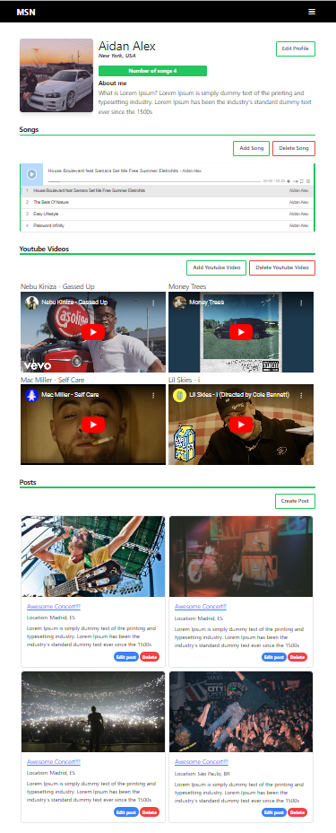
    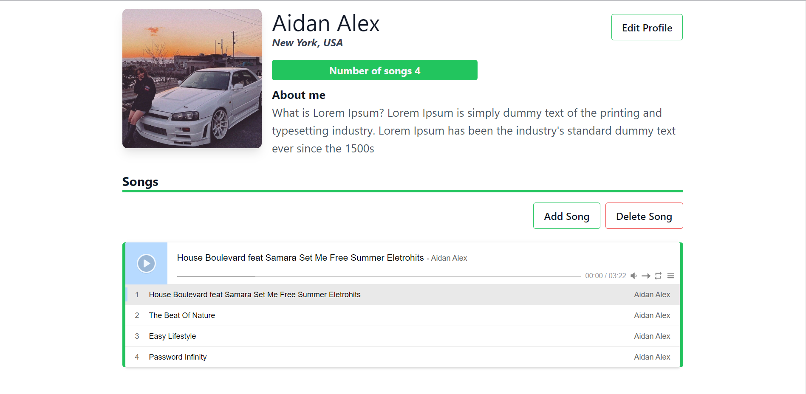
      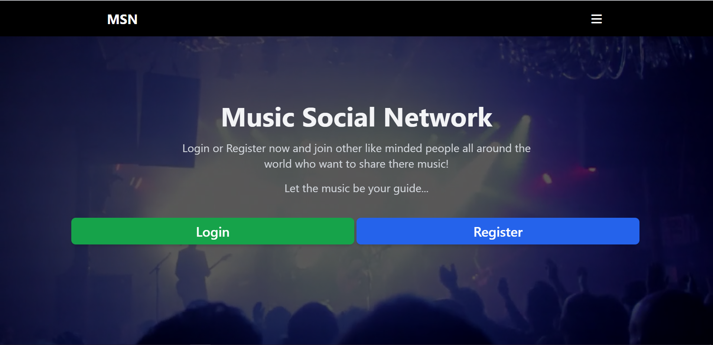
      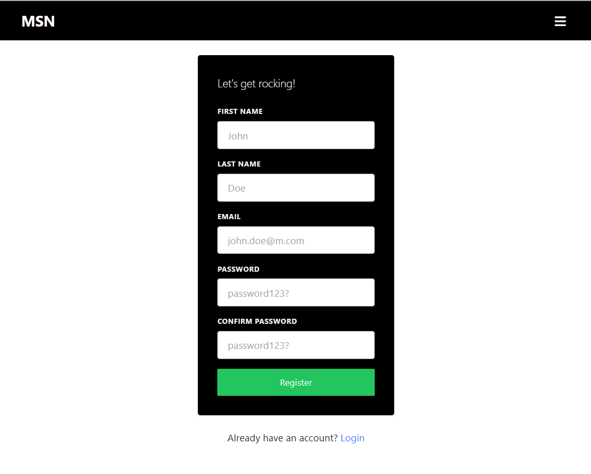
      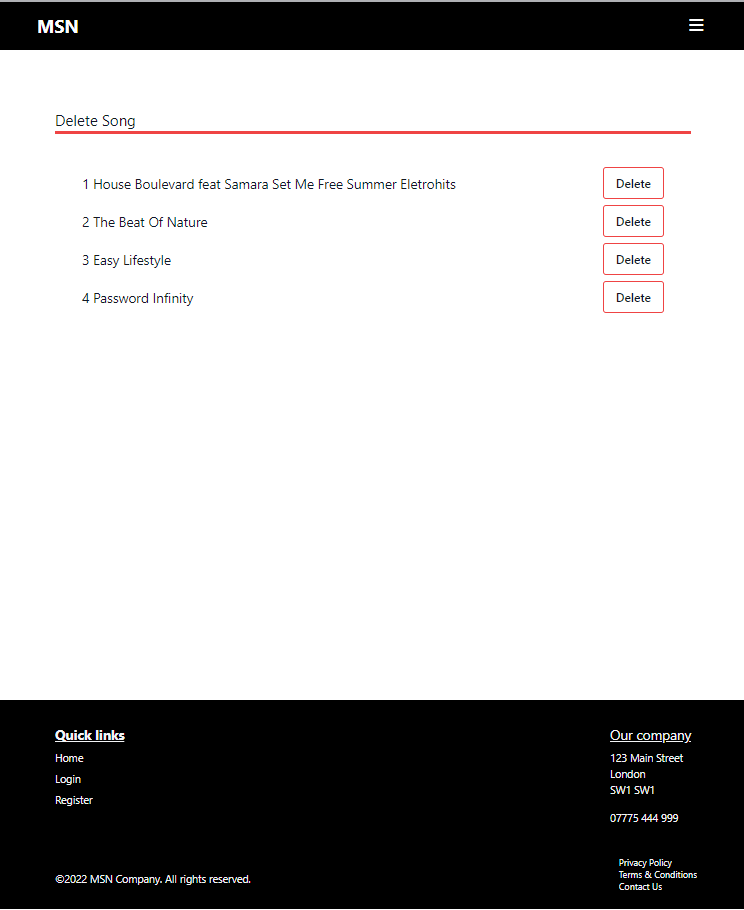
      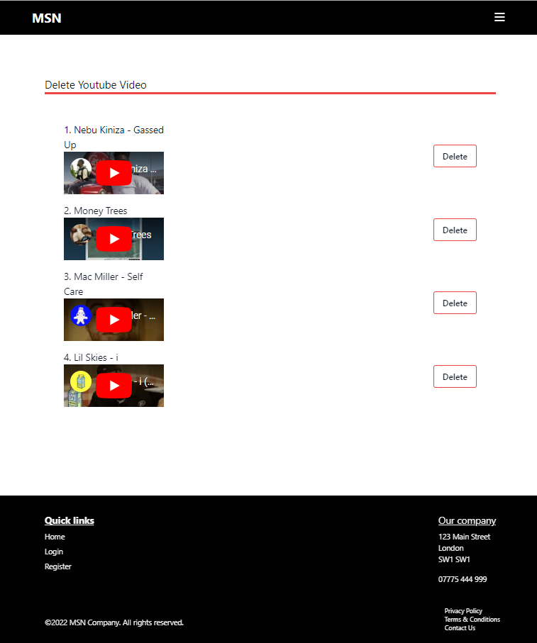
</p>

## Posts

<p float="left">
    
  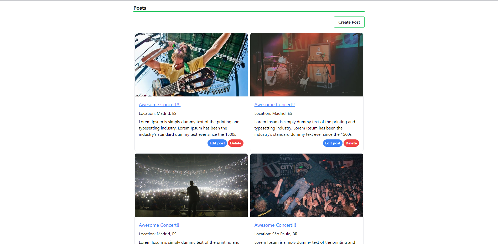
  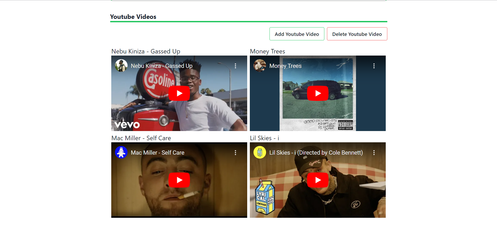
  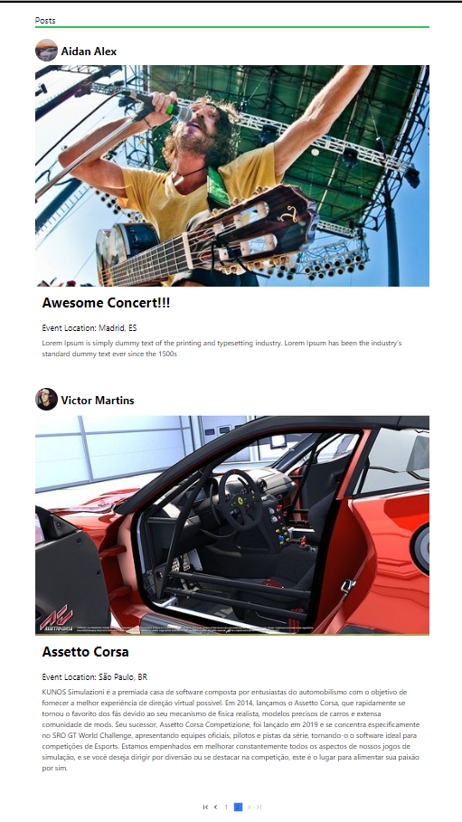
  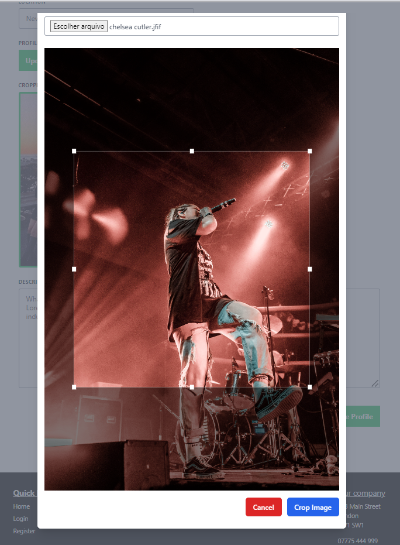
  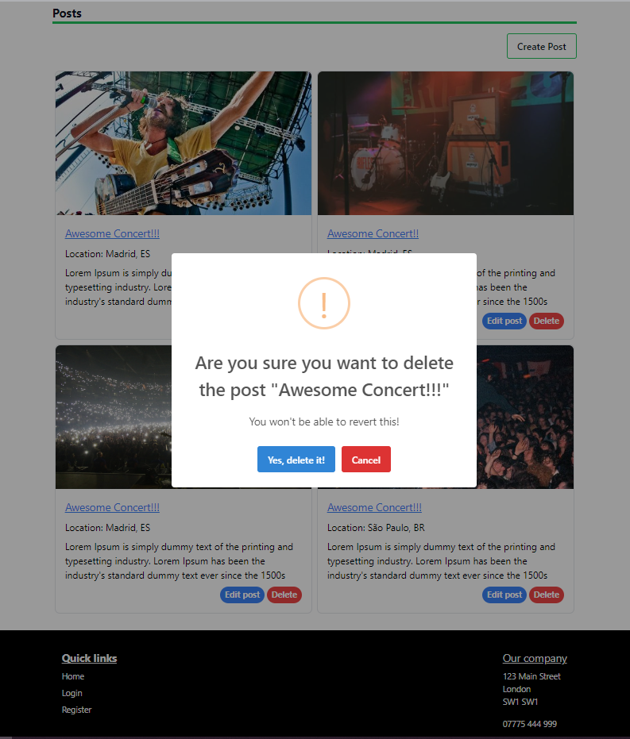

</p>
